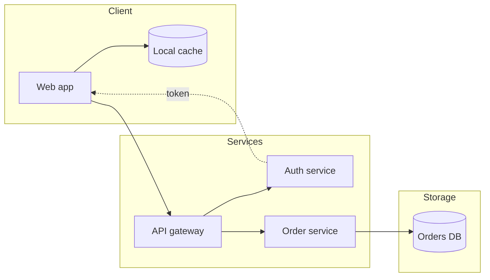

# markup2html

Render Markdown (`.md`) and Org (`.org`) documents to standalone,
RFC-styled HTML pages.

- **`markup2html.mjs`** — the renderer and CLI (replaces the former
  `contrib/markup2html.sh`). Handles conversion (marked for Markdown,
  batch Emacs for Org from the CLI, in-process Org export from Emacs)
  and the full HTML assembly. Runs on bun or node.
- **`markup2html.el`** — thin Emacs wiring around the same script; all
  rendering happens in the script.
- **`slim-marked.mjs`** — maintenance script for the vendored marked.

The package is self-contained: it ships `rfc-style.css` (the base
stylesheet, inlined into every page) and a pinned, vendored copy of
marked (slimmed `marked.esm.js` — see below). The slimmed variant drops
marked functions that markup2html never uses: 41.7 KB → 35.7 KB.

## Demo

See [readme-sample.pdf](./readme-sample.pdf) or [readme-sample.html](readme-sample.html), to see the result of rending this file into HTML or PDF (the pdf file is creaed from the html one).

## CLI

```sh
bun markup2html.mjs  [-o OUTPUT] [--css FILE] <input.md | input.org>
# or: node markup2html.mjs ...   (both runtimes work)
```

Writes the page to **stdout**; `-o OUTPUT` writes it to a file instead
(`-o -` is the same as stdout). `--css` replaces the packaged
stylesheet. Requirements: bun or node on PATH, and emacs on PATH for
`.org` inputs.

### The `--html` mode

In `--html` mode the script skips markdown/org conversion entirely: it
reads a ready-made HTML **body fragment** from stdin and wraps it in the
page shell — `<head>` with the inlined stylesheet and CDN layer, the
title, the meta table, the `<main class="rfc markdown-body">` wrapper,
and the same conditional enhancers as file mode (mermaid loader,
highlight.js, floating TOC — each only when the body contains one).

```sh
markup2html.mjs --html [--title TITLE] [--meta "KEY: VAL"]... [--h1] \
    [-o OUTPUT] [--css FILE] < body.html
```

### Behavior

- The input is a body **fragment**, not a complete document — no
  `<html>`, `<head>` or `<body>`; the shell provides them.
- `--title` sets the `<title>` (HTML-escaped). Without it the title is
  empty.
- `--h1` additionally emits the title as the page's `<h1>`. Org bodies
  from `org-export-as` don't contain a heading, so markup2html.el passes
  this flag; when the fragment already carries its own `<h1>`, omit it.
- Each `--meta "KEY: VAL"` adds one row to the key/value table at the
  top of the page (the first colon splits; leading spaces of the value
  are stripped). Values are inserted as-is apart from HTML escaping —
  FILETAGS-style `:a:b:` values must be transformed before passing.
- The enhancer scan runs on the fragment: `language-mermaid` /
  `src-mermaid` in the body pulls in the mermaid loader, a
  `<code class="language-…">` block pulls in highlight.js, and an
  `h2`–`h4` pulls in the floating TOC. A fragment without any of these
  produces a script-free page.
- Without `-o` the page goes to stdout; `-o -` is the same, so the mode
  doubles as a stdin→stdout filter. `--css` swaps the inlined
  stylesheet.

Who uses it:

- **markup2html.el** — exports the Org buffer in-process and pipes it here
  with `--title`, `--h1` and one `--meta` per leading `#+KEYWORD:` line.
- Anything else that produces an HTML fragment and wants the RFC shell —
  the bytes are identical to what the file modes emit for the same
  document.

## Emacs

Requires Emacs 30.1+ (the Elisp module uses modern APIs like
`string-lines` and `string-replace`).

| Command                          | What it does                                      |
| -------------------------------- | ------------------------------------------------- |
| `markup2html-export`             | Render the visited file, write `<stem>.html`      |
| `markup2html-export-and-preview` | Export, then open the result in a browser         |
| `markup2html-preview-exported`   | Open the exported `<stem>.html` (error if absent) |
| `markup2html-command`            | `markdown-command`-compatible hook                |

All commands work in `markdown-mode`, `gfm-mode`, `markdown-ts-mode`
and `org-mode` buffers alike. Markdown buffers are rendered as a whole
from the visited file (region arguments are ignored; save first to
include your edits); Org buffers are exported in-process, unsaved
edits included.

### Doomemacs setup

```elisp
;; in package.el
(package! markup2html
  :recipe (:host github :repo "robert-zaremba/markup2html"))

;;
;; in config.el
;;

(with-eval-after-load 'org
  (require 'markup2html) ; this auto-registers the C-c C-e r dispatcher entry
  (define-key org-mode-map (kbd "C-c c p") #'markup2html-export-and-preview)
  (define-key markdown-mode-map (kbd "C-c c v") #'markup2html-preview-exported))

;; if you use markdow-mode
(with-eval-after-load 'markdown-ts-mode
  (require 'markup2html)
  (setopt markdown-command #'markup2html-command)  ;; native markdow compile command, not available in markdow-ts-mode
  (define-key markdown-mode-map (kbd "C-c c p") #'markup2html-export-and-preview)
  (define-key markdown-mode-map (kbd "C-c c v") #'markup2html-preview-exported))

;; if you use the traditional markdown-mode
```

### Dev setup

Clone the repository and:

```elisp
(use-package markup2html
  :load-path "/path/to/markup2html")
```

### markdown-mode integration

- **Runtime selection**: `markup2html-js-runtime` — `'bun` (default) or
  `'node` (set via `setopt`).
- **Render and preview** route markdown-mode's native commands through
  markup2html.

In `markdow-mode` (not available in `markdow-ts-mode`) we can set the `markdown-command` and use it
in `markdow-compile`: `C-c C-c m` compiles into the `*Markdown output*` buffer
, `C-c C-c p` previews in the browser, and `C-c C-c e` writes the HTML file next to the source.

- **Open the rendered page externally** on demand, mirroring
  markdown-mode's `markdown-open-command` (bound to `C-c C-c o`):

```elisp
(setopt markdown-open-command
        (lambda ()
          (browse-url-of-file (markup2html-export))))
```

### org-mode integration

Org buffers are exported to body-only HTML **in-process** (`org-export-as`)
and piped to the script's stdin (`--html` assembly mode).

This wires natively with the org-mode dispatcher (`org-export-define-derived-backend`),
invoked through `C-c C-e r`:

- `r` = export (and write) to html
- `o` = export and open.

## Output

Standalone page with the base stylesheet inlined; github-markdown-css
and the highlight.js theme layer on top via CDN links pinned with SRI
hashes (no theme switching; offline the page keeps the base look).
Pages with mermaid diagrams, code fences or sections load the
corresponding client-side enhancers; everything else stays
script-free. Documents with YAML front matter (md) or leading
`#+KEYWORD:` lines (org) render it as a key/value table; documents
with sections get a floating table of contents, open by default.

## Upgrading pinned assets

- `marked`: download the new `lib/marked.esm.js` over the vendored
  `marked.esm.js`, then run `bun slim-marked.mjs marked.esm.js`. Every
  cut in the slim script asserts its markers, so an upstream restructure
  fails loudly instead of silently corrupting the file; re-render a
  document and diff to confirm the output is still what you expect.
- CDN assets (github-markdown-css, highlight.js, mermaid): bump the
  version and its SRI hash together in `markup2html.mjs`
  (`curl -s URL | openssl dgst -sha384 -binary | openssl base64 -A`).

## Samples

```ts
function bubbleSort(numbers: number[]): number[] {
  // Create a copy to avoid mutating the original array
  const arr = [...numbers];
  const n = arr.length;

  for (let i = 0; i < n - 1; i++) {
    let swapped = false;

    for (let j = 0; j < n - 1 - i; j++) {
      if (arr[j] > arr[j + 1]) {
        [arr[j], arr[j + 1]] = [arr[j + 1], arr[j]];
        swapped = true;
      }
    }

    // Stop early if no swaps occurred in this pass
    if (!swapped) break;
  }

  return arr;
}
```


